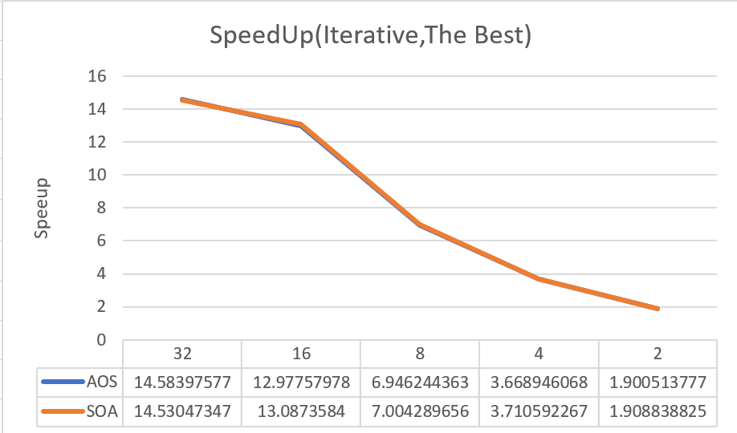

#  Report K-means clustering algorithm
> 台灣科技大學: 陳勁銘

> StudentID: M10903311

> 實驗室:CFDLAB

[TOC]

## 前言

### Ref
* [Ref01](https://chih-sheng-huang821.medium.com/%E6%A9%9F%E5%99%A8%E5%AD%B8%E7%BF%92-%E9%9B%86%E7%BE%A4%E5%88%86%E6%9E%90-k-means-clustering-e608a7fe1b43)
* [Ref002](https://ithelp.ithome.com.tw/articles/10209058)
* [GitHub](https://github.com/Eduardofig/k-means)

* 老師上課講義


### To do list

#### HW 03
- [x] All the needed data by the k-means algorithm should be stored in struct myData declared in kmeans.hpp
#### HW 05

- [x] OpenMP
- [X] Binding

#### HW 07

- [X] OPENCL


### 資料整理

### 分類
* 非監督式學習
* 物以類聚

### 過程

參考 https://chih-sheng-huang821.medium.com/%E6%A9%9F%E5%99%A8%E5%AD%B8%E7%BF%92-%E9%9B%86%E7%BE%A4%E5%88%86%E6%9E%90-k-means-clustering-e608a7fe1b43


1. 我們先設定好要分成多少(k)群。
2. 然後在feature space(x軸身高和y軸體重組出來的2維空間，假設資料是d維，則會組出d維空間)隨機給k個群心
3. 每個資料都會所有k個群心算歐式距離(歐基李德距離Euclidean distance，其實就是直線距離公式，從小學到大的那個距離公式，這邊距離當然也可以換成別種距離公式，但基本上都還是以歐式距離為主)
4. 將每筆資料分類判給距離最近的那個群心。
5. 每個群心內都會有被分類過來的資料，用這些資料更新一次新的群心。
6. 一直重複3–5，直到所有群心不在有太大的變動(收斂)，結束。


## 1.Sequential program (Discussion : Which data layout is faster? AOS or SOA? )

> Back up your discussions by conducting experiments by varying DIM, N, and K

### data struct

```cpp
struct myData {
	size_t DIM; // number of dimention
	size_t N; //number of point 
	size_t K; // number of k clusters 
	vector<float> pts; // 數量為 DIM * N
	vector<float> currentCentroids; // 數量為 k * DIM
 	vector<float> oldCentroids; // 數量為 k * DIM
	vector<size_t> group; // 數量為K
};
```

主程式中:
```c++
myData data;//宣告一個 data 的 data struct
```

* 注意事項
	* currentCentroids 如果K在外圈 >> DIM要連續 


### main loop
我們最後輸出
```c++
std::cout              << "\n" 
/*	#Clusters(K) 	*/ << argv[1] << ", " 
/*	tolerance       */ << argv[2] << ", " 
/*	#iters          */ << it << "," 
/*	all (iter)      */ << timer[0].elapsedTime() << ","
/* 	AssignGroups  	*/ << timer[1].elapsedTime() << ","
/*	UpdateCentroids */ << timer[2].elapsedTime() << endl; 
```

### 讀資料區`readCSV`

討論 : 所有的vector使用at存取資料使得資料更為安全

1. AOS: coordinates of the same point are stored continuously. 
	* x1, y1, z1, x2, y2, z2, x3, y3, z3, x4, y4, z4, …

kmeansAOS.cpp
```c++
	inp.clear();
	inp.seekg(0, inp.beg);
	data.pts.resize(noLines*noAttributes);
	for (size_t whichPt = 0; whichPt < noLines; ++whichPt) {
		inp.getline(buf, 4096);
		auto it = buf;
		for (size_t whichDim = 0; whichDim < noAttributes;++whichDim) {
			auto x = atof(it);
			data.pts[whichPt*noAttributes+whichDim] = x;			//@AOS
			while(*it!=',') ++it;
			it++;
		}
	}
```
2. SOA: coordinates of the same dimension are stored continuously.
	* x1, x2, x3, x4, … y1, y2, y3, y4, … z1, z2, z3, z4, …
kmensSOA.cpp
```c++
	inp.clear();
	inp.seekg(0, inp.beg);
	data.pts.resize(noLines*noAttributes);
	for (size_t whichPt = 0; whichPt < noLines; ++whichPt) {
		inp.getline(buf, 4096);
		auto it = buf;
		for (size_t whichDim = 0; whichDim < noAttributes;++whichDim) {
			auto x = atof(it);
			data.pts[whichPt+whichDim*noLines] = x;					//@SOA
			while(*it!=',') ++it;
			it++;
		}
	}
```

* 輸入中 外圈為 `whichPt` 內圈為 `whichDim`
	* `AOS` 友善
	* `SOA` 不友善
	

### `UpdateCentroids` 中 

> 我們決定了 `currentCentroids` 與 `oldCentroids` 的矩陣排法，可以觀察到外迴圈應該要放 `count_k` 而 內迴圈則是 `whichDim`

```c++
data.currentCentroids.resize(data.K*data.DIM);		// vector 大小
data.currentCentroids[data.DIM*count_k+whichDim]	// 輸入資料
data.currentCentroids.at(data.DIM*count_k+whichDim)	// 取出資料(檢查邊界)
data.currentCentroids[data.DIM*count_k+whichDim]	// 取出資料
```

```c++
data.oldCentroids.resize(data.K*data.DIM);		 // Vector 大小
data.oldCentroids[count_k+whichDim*data.K]	 	 // 輸入資料
data.oldCentroids.at(count_k+whichDim*data.K)		// 取出資料(檢查邊界)
data.oldCentroids[count_k+whichDim*data.K]		// 取出資料
```


### AssignGroups(part01)

以下這行可以省略，因為我們只需要比較大小，而**不需要知道真正的數值**
```c++
// distance_sum_DIM = sqrt(distance_sum_DIM);
```

* 取點
	* 看到再取點時 外迴圈為 `whichPt`，內迴圈才是 `whichDim`
	* AOS 不友善 `data.pts.at(whichPt+whichDim*data.N)`
	* SOA 友善 `data.pts.at(whichPt*data.DIM+whichDim)`

* 寫入 :
	* 寫入情況下，我們知道在C++中矩陣如果為 `dis[whichPt][count_k]` 則count為連續則要放內圈
	* 在這個迴圈中 `SOA` 與 `AOS` **都是優良的**

`SOA`
```c++
for (size_t whichPt = 0; whichPt < N_value; whichPt++){
	for (size_t count_k = 0; count_k < K_value; count_k++){
		distance_sum_DIM = 0;
		for (size_t whichDim = 0; whichDim < DIM_value ; whichDim++){
			distance_sum_DIM += pow((data.currentCentroids.at(data.DIM*count_k
				+whichDim)- data.pts.at(whichPt+whichDim*data.N)),2);
		}
		// distance_sum_DIM = sqrt(distance_sum_DIM);  // 刻意省略
		dis[whichPt][count_k] = distance_sum_DIM;
	}
}
```

`AOS`
```c++
for (size_t whichPt = 0; whichPt < N_value; whichPt++){
	for (size_t count_k = 0; count_k < K_value; count_k++){
		distance_sum_DIM = 0;
		for (size_t whichDim = 0; whichDim < DIM_value ; whichDim++){
			distance_sum_DIM += pow((data.currentCentroids.at(data.DIM*count_k \
						 +whichDim)- data.pts.at(whichPt*data.DIM+whichDim)),2);
		}
		// distance_sum_DIM = sqrt(distance_sum_DIM); // 刻意省略
		dis[whichPt][count_k] = distance_sum_DIM;
	}
}
```

### AssignGroups(part02)

這裡也沒什麼問題，都為連續只不過之後要注意`dis_min`在平行化的情況下要設立私有變數
`AOS`與`AOS`
```c++
for (size_t whichPt = 0; whichPt < N_value; whichPt++){
	dis_min = FLT_MAX;
	for (size_t count_k = 0; count_k < K_value; count_k++){
		if (dis_min > dis[whichPt][count_k] ){
			dis_min = dis[whichPt][count_k];
			data.group[whichPt] = count_k;
		}
	}
}
```

### UpdateCentroids

* 取點
	* 看到再取點時 內迴圈為 `whichPt`，外迴圈才是 `whichDim`
	* AOS 友善 `data.pts.at(whichPt+whichDim*data.N)`
	* SOA 不友善 `data.pts.at(whichPt*data.DIM+whichDim)`

* 寫入
	* `data.oldCentroids` 寫入檔案也是友善(`count_k`在內迴圈)

#### 
`SOA`
```c++
for (size_t whichDim = 0; whichDim < data.DIM; whichDim++){
	for (size_t whichPt = 0; whichPt < N_value; whichPt++){
		center_tem[whichDim*K_value + data.group[whichPt]]+=data.pts[whichPt*data.DIM+whichDim];
		count[data.group[whichPt]]++;
	}
}
	
for (size_t whichDim = 0; whichDim < data.DIM; whichDim++){
	for (size_t i = 0; i < K_value; i++){
		data.currentCentroids[i+whichDim*data.K]= center_tem[whichDim*K_value + i]*DIM_value/float(count[i]);
	}
}
```

`AOS`
```c++
for (size_t whichDim = 0; whichDim < data.DIM; whichDim++){
	for (size_t whichPt = 0; whichPt < N_value; whichPt++){
		center_tem[whichDim*K_value + data.group[whichPt]]+=data.pts[whichPt+data.N+*hichDim];
		count[data.group[whichPt]]++;
	}
}
	
for (size_t whichDim = 0; whichDim < data.DIM; whichDim++){
	for (size_t i = 0; i < K_value; i++){
		data.currentCentroids[i+whichDim*data.K]= center_tem[whichDim*K_value + i]*DIM_value/float(count[i]);
	}
}
```


### 檢查收斂 HasConverged
主迴圈中每一次也都有檢查所以我們也進行分析
* 寫入 
* 讀值相當友善

`AOS`與`SOA`
```c++
	for (size_t whichDim = 0 ; whichDim < DIM_value ; whichDim++){
		for (size_t count_k  = 0 ; count_k < K_value ; count_k++){	
			tolerance_sum += std::abs(data.oldCentroids[count_k+whichDim*data.K] - data.currentCentroids[count_k+whichDim*data.K],2);
		}
	}

	for (size_t i =0; i <K_value*DIM_value ; i++ ){
		data.currentCentroids[i] = data.oldCentroids[i];
	}
```

#### 觀察到的有趣資訊

1. `return 255;` 就是`return -1;`

2. `#pragma once` 可以取代以前`#if define....`

3. #include<chrono> 為C++ 11的時間庫，提供計時，時鐘等功能。
	
## 2.OpenMP版本


有加入Fisrt Touch 的參數

```cpp
vector<double> data.pts; // 刻意加入
vector<double> dis;     // 自然加入
```

### `void readCSV()`

> 我們必須要想辦法在資料一開始就被安排在各個 thread 上面然後加入 binding 試看看 ，因為等等讀數值的時候沒有平行

```c++
// First Touch
#pragma omp parallel for schedule(static)
for (size_t whichPt = 0; whichPt < noLines; ++whichPt) {
{
	for (size_t whichDim = 0; whichDim < noAttributes;++whichDim) {
		data.pts[whichPt*noAttributes+whichDim] = 0.0;
	}
}
```

> 目前還沒計畫 IO區塊平行 這邊可能會因為上一個 Part2 中我們設計的記憶體關係，造成 Part3 比較慢，**值得套論兩者關係**

```c++
// 真正的讀數值
for (size_t whichPt = 0; whichPt < noLines; ++whichPt) {
	inp.getline(buf, 4096);
	auto it = buf;
	for (size_t whichDim = 0; whichDim < noAttributes;++whichDim) {
		auto x = atof(it);
		data.pts[whichPt*noAttributes+whichDim] = x;
		while(*it!=',') ++it;
		it++;
	}
}
```


### InitializeCentroid

主要目標也是要讓疊帶的時候記憶體配置，那就先跳過了


### AssignGroups(迭代區)

#### Part1


```c++ 
// 平行前
	for (size_t whichPt = 0; whichPt < N_value; whichPt++){
		for (size_t count_k = 0; count_k < K_value; count_k++){
			distance_sum_DIM = 0;
			for (size_t whichDim = 0; whichDim < DIM_value ; whichDim++){
				distance_sum_DIM += pow((data.currentCentroids.at(count_k+whichDim*data.K)- data.pts.at(whichPt*data.DIM+whichDim)),2);
			}
			// distance_sum_DIM = sqrt(distance_sum_DIM);
			dis[whichPt][count_k] = distance_sum_DIM;
		}
	}

	for (size_t whichPt = 0; whichPt < N_value; whichPt++){
		dis_min = FLT_MAX;
		for (size_t count_k = 0; count_k < K_value; count_k++){
			if (dis_min > dis[whichPt][count_k] ){
				dis_min = dis[whichPt][count_k];
				data.group[whichPt] = count_k;
			}
		}
	}
```


> 這裡在做的事情其實很簡單，就是把每一個**獨立點**與現**有的形心距離**算出,存入矩陣 `dis[whichPt][count_k]`

> 所以我們可以很清楚的資料我們可以平行**各個點**，而形心(`data.currentCentroids`)為 唯獨入資料根據點來平行，整體程式是用 whichPT來平行所以還在思考要如何在這個大迴圈中一直需要的數值 `data.currentCentroids` 在各個thread中的記憶體，但因為大小很小所以可能已經可以在 cacheLine 裡面了

* 而這邊的一次會跑的迴圈大小為 DIM_value * K_value * N_value(可以平行) 可以說是最多計算的區域又有pow這個function
	* distance_sum_DIM += pow((data.currentCentroids.at(count_k+whichDim*data.K)- data.pts.at(whichPt*data.DIM+whichDim)),2);


```c++ 
// 平行後
	#pragma omp parallel for schedule(static) default(none) firstprivate(distance_sum_DIM,DIM_value,K_value,N_value) shared(data,dis) proc_bind(spread)
	for (size_t whichPt = 0; whichPt < N_value; whichPt++){
		for (size_t count_k = 0; count_k < K_value; count_k++){
			distance_sum_DIM = 0;
			for (size_t whichDim = 0; whichDim < DIM_value ; whichDim++){
				distance_sum_DIM += pow((data.currentCentroids.at(count_k+whichDim*data.K)- data.pts.at(whichPt*data.DIM+whichDim)),2);
			}
			// distance_sum_DIM = sqrt(distance_sum_DIM);
			dis[whichPt][count_k] = distance_sum_DIM; //first polo
		}
	}


	#pragma omp parallel for schedule(static) default(none) firstprivate(N_value,K_value,dis_min) shared(data,dis) proc_bind(spread)
	for (size_t whichPt = 0; whichPt < N_value; whichPt++){
		dis_min = FLT_MAX;
		for (size_t count_k = 0; count_k < K_value; count_k++){
			if (dis_min > dis[whichPt][count_k] )
			{
				dis_min = dis[whichPt][count_k];
				data.group[whichPt] = count_k;
			}
		}
	}
```

> 跟前面意思一樣其實各個點不需要溝通


### UpdateCentroids

* 整個程式的平行核心為 `whichPt` 所以我們要思考的是 在使用 `#pragma omp for schedule(static)`切割for 迴圈的時候 到底需不需要等
	* 答案是不需要 我們可以把 總量 center_tem 與  總數 counter_tem 分開 後 用 reduction 相加 `reduction(+:counter_tem[0:data.DIM:K_value])` `reduction(+:center_tem[0:data.DIM:K_value])`
	* 每一個dimention 又是獨立的，所以自己的thread做完就不用等了(如果你去等他其中一個 thread if 一直過 那大家不就都要等他，整個speedUP 變成會決定於 loadbalance 問題
	* 所以我們加入 `nowait `


```c++

swap(data.oldCentroids, data.currentCentroids);
float	center_tem[DIM_value*K_value] = {0.};
int		count[K_value] = {0};

// 平行後(AOS)
#pragma omp parallel default(none) firstprivate(K_value,N_value,DIM_value) shared(data) \
reduction(+:count[:]) reduction(+:center_tem[:])
{
	for (size_t whichDim = 0; whichDim < data.DIM; whichDim++){
		#pragma omp for schedule(static) nowait
		for (size_t whichPt = 0; whichPt < N_value; whichPt++){
			center_tem[whichDim*K_value + data.group[whichPt]]+=data.pts[whichPt*data.DIM+whichDim];
			count[data.group[whichPt]]++;
		}
	}
}

for (size_t whichDim = 0; whichDim < data.DIM; whichDim++){
	for (size_t i = 0; i < K_value; i++){
		data.currentCentroids[i+whichDim*data.K]= center_tem[whichDim*K_value + i]*DIM_value/float(count[i]);
	}
}

```


這邊參考老師的
```c++
// Array section, new int OpenMP 4.5
/// 28b.cpp
#include <iostream>
#include <omp.h>
#include <cstdlib>
using namespace std;
int main(int argc, char **argv) 
{
    int votes[5]={0};
    argc>1 ? srand(atoi(argv[1])) : srand(1);    // 反正就是在產生亂數 
    auto t1 = omp_get_wtime();
    #pragma omp parallel reduction(+:votes[:])
    {
        for(int i=0; i<1000000; ++i) 
        {
            votes[ rand()%5 ] ++;
        }
    }
    t1 = omp_get_wtime() - t1;
    cout << "\nTotal: ";
    for(auto i: votes) cout << i << " ";
    cout << "\nTime spent: " << t1;
    return 0;
}
```


### 繪圖區

每筆資資料為五個取最好(時間最少) 或是平均數值畫圖

* SpeedUP = \frac{Elapsed time of Sequential program}{Elapsed time of presently program}
* Sequential program 表示未平行前的程式

```Makefile
# ompenmp (first touch: on)
aos-omp.exe: src/main.cpp kmeansAOSp.o 
	$(CC) $(CFLAGS) $< -o $@ kmeansAOSp.o 

soa-omp.exe: src/main.cpp kmeansSOAp.o 
	$(CC) $(CFLAGS) $< -o $@ kmeansSOAp.o 

# ompenmp
aos-omp-Foff.exe: src/main.cpp kmeansAOSp_FirstToch_off.o 
	$(CC) $(CFLAGS) $< -o $@ kmeansAOSp_FirstToch_off.o 

soa-omp-Foff.exe: src/main.cpp kmeansSOAp_FirstToch_off.o 
	$(CC) $(CFLAGS) $< -o $@ kmeansSOAp_FirstToch_off.o 

# sequential (first touch: on)
aos.exe: src/main.cpp kmeansAOS.o 
	$(CC) $(CFLAGS) $< -o $@ kmeansAOS.o 

soa.exe: src/main.cpp kmeansSOA.o 
	$(CC) $(CFLAGS) $< -o $@ kmeansSOA.o 
```

### 實測

* 為了跟其他人比較這次打算先使用 02 資料來做本次演算法

| Information    |           |	
| -------------- | ----------|
| 資料大小	      |   		  |
| noAttributes   |	3 		 |
| noLines		 |  245057   | 
| 使用的K	     | 	5		  |
| 收斂值	   	 |  1.00E-09  | 
| 				| 		     | 
| BindingThread	| 		 	 |
| OMP_PLACES 	| cores 	 | 
| OMP_PROC_BIND	| spread     |
| Firs-touch	| ON		 | 


- [X] First touch
- [X] export OMP_PLACES=cores
- [X] export OMP_PROC_BIND=spread


> 目前看其他做平行計算的人都是取峰值，所以圖B表示The Best(時間最小)而圖片A則表示平均值，我們可以看到這台機器的電腦架構如下


> 可以看到下表格 Efficienc(SpeedUp / #threads)
* 參考:圖：B.I

|	#threads	|SpeedUp(Iterative) |   |  Efficienc(Iterative)	 |   |  
|---------------|---------------|----------------|------------------|-----------------|
|				|AOS			| SOA			 | AOS				| SOA 			  |
|	2			| 1.900513777	| 	1.908838825  |   0.950256888	|	0.954419413   |
|	4			| 3.668946068	| 	3.710592267  |   0.917236517	|	0.927648067   |
|	8			| 6.946244363	| 	7.004289656  |   0.868280545	|	0.875536207   |
|	16			| 12.97757978	| 	13.0873584	 |   0.811098736	|	0.8179599     |
|	32			| 14.58397577	| 	14.53047347  |   0.455749243	|	0.454077296   |

> 我們的 Efficienc 隨著速 thread 超過 16 這台機器的 Core數量效率降低，但是儘管如此我們最在意的SpeedUp還是有從12.9些微提升到 14.58


#### 圖A : average

* 圖A.I


* 圖A.A


* 圖A.U


#### 圖B : Best

* 圖B.I


* 圖B.A


* 圖B.U


## 3.OPENCL 版本

### 介紹環境 clinfo


#### Platform (NVIDIA CUDA)
```cpp
// GPU device
  Platform Name                                   NVIDIA CUDA
Number of devices                                 2
```

```cpp
// A utility function for getting a specific platform based on vendor's name
auto getPlatform(const std::string& vendorNameFilter) {
    std::vector<cl::Platform> platforms;
    cl::Platform::get(&platforms);
    for(const auto& p: platforms) {
        if(p.getInfo<CL_PLATFORM_VENDOR>().find(vendorNameFilter) != std::string::npos) {
            return p;
        }
    }
    throw cl::Error(CL_INVALID_PLATFORM, "No platform has given vendorName");
}


data.platform = getPlatform("NVIDIA");       // Mesa, pocl
```

#### Device (NVIDIA Tesla K20c + Tesla C2075 )


```cpp
// A utility function for getting a device based on the amount of global memory.
auto getDevice(cl::Platform& platform, cl_device_type type, size_t globalMemoryMB) {
    std::vector<cl::Device> devices;
    platform.getDevices(type, &devices);
    globalMemoryMB *= 1024 * 1024; // from MB to bytes
    for(const auto& d: devices) {
        if( d.getInfo<CL_DEVICE_GLOBAL_MEM_SIZE>() >= globalMemoryMB ) return d;
    }
    throw cl::Error(CL_INVALID_DEVICE, "No device has needed global memory size");
}


data.device = getDevice(data.platform,CL_DEVICE_TYPE_GPU, 1024); // CL_DEVICE_TYPE_ALL,1024 -> 1G
```
> 因為 Tesla C2075 只支援 CL1.1 所以使用 NVIDIA Tesla K20c 跑此program


如果沒有找到以下 滿足1GB的就要小心，會跑出
> what():  No device has needed global memory size

但是Tesla K20c擁有4.6GiB所以不用擔心!


```cpp
// 擷取一些可能再寫code （最佳化）需要了解的資訊
  Device Name                                     Tesla K20c

  Max work item dimensions                        3
  Max work item sizes                             1024x1024x64
  Max work group size                             1024

  Preferred work group size multiple              32 

  Global memory size                              4972937216 (4.631GiB)
  Max memory allocation                           1243234304 (1.158GiB)
  
  Alignment of base address                       4096 bits (512 bytes)
  Global Memory cache type                        Read/Write
  Global Memory cache size                        212992 (208KiB)
  Global Memory cache line                        128 bytes

```


```cpp
// 細節
  Device Name                                     Tesla K20c
  Device Vendor                                   NVIDIA Corporation
  Device Vendor ID                                0x10de
  Device Version                                  OpenCL 1.2 CUDA
  Driver Version                                  384.66
  Device OpenCL C Version                         OpenCL C 1.2 
  Device Type                                     GPU
  Device Available                                Yes
  Device Profile                                  FULL_PROFILE
  Device Topology (NV)                            PCI-E, 03:00.0
  Max compute units                               13
  Max clock frequency                             705MHz
  Compute Capability (NV)                         3.5
  Device Partition                                (core)
    Max number of sub-devices                     1
    Supported partition types                     None
  Max work item dimensions                        3
  Max work item sizes                             1024x1024x64
  Max work group size                             1024
  Compiler Available                              Yes
  Linker Available                                Yes
  Preferred work group size multiple              32 
  Warp size (NV)                                  32
  Preferred / native vector sizes                 
    char                                                 1 / 1       
    short                                                1 / 1       
    int                                                  1 / 1       
    long                                                 1 / 1       
    half                                                 0 / 0        (n/a)
    float                                                1 / 1       
    double                                               1 / 1        (cl_khr_fp64)
  Half-precision Floating-point support           (n/a)
  Single-precision Floating-point support         (core)
    Denormals                                     Yes
    Infinity and NANs                             Yes
    Round to nearest                              Yes
    Round to zero                                 Yes
    Round to infinity                             Yes
    IEEE754-2008 fused multiply-add               Yes
    Support is emulated in software               No
    Correctly-rounded divide and sqrt operations  Yes
  Double-precision Floating-point support         (cl_khr_fp64)
    Denormals                                     Yes
    Infinity and NANs                             Yes
    Round to nearest                              Yes
    Round to zero                                 Yes
    Round to infinity                             Yes
    IEEE754-2008 fused multiply-add               Yes
    Support is emulated in software               No
    Correctly-rounded divide and sqrt operations  No
  Address bits                                    64, Little-Endian
  Global memory size                              4972937216 (4.631GiB)
  Error Correction support                        Yes
  Max memory allocation                           1243234304 (1.158GiB)
  Unified memory for Host and Device              No
  Integrated memory (NV)                          No
  Minimum alignment for any data type             128 bytes
  Alignment of base address                       4096 bits (512 bytes)
  Global Memory cache type                        Read/Write
  Global Memory cache size                        212992 (208KiB)
  Global Memory cache line                        128 bytes
  Image support                                   Yes
    Max number of samplers per kernel             32
    Max size for 1D images from buffer            134217728 pixels
    Max 1D or 2D image array size                 2048 images
    Max 2D image size                             16384x16384 pixels
    Max 3D image size                             4096x4096x4096 pixels
    Max number of read image args                 256
    Max number of write image args                16
  Local memory type                               Local
  Local memory size                               49152 (48KiB)
  Registers per block (NV)                        65536
  Max constant buffer size                        65536 (64KiB)
  Max number of constant args                     9
  Max size of kernel argument                     4352 (4.25KiB)
  Queue properties                                
    Out-of-order execution                        Yes
    Profiling                                     Yes
  Prefer user sync for interop                    No
  Profiling timer resolution                      1000ns
  Execution capabilities                          
    Run OpenCL kernels                            Yes
    Run native kernels                            No
    Kernel execution timeout (NV)                 No
  Concurrent copy and kernel execution (NV)       Yes
    Number of async copy engines                  2
  printf() buffer size                            1048576 (1024KiB)
  Built-in kernels                                
  Device Extensions                               cl_khr_global_int32_base_atomics cl_khr_global_int32_extended_atomics cl_khr_local_int32_base_atomics cl_khr_local_int32_extended_atomics cl_khr_fp64 cl_khr_byte_addressable_store cl_khr_icd cl_khr_gl_sharing cl_nv_compiler_options cl_nv_device_attribute_query cl_nv_pragma_unroll cl_nv_copy_opts cl_nv_create_buffer
```

```cpp
  Device Name                                     Tesla C2075
  Device Vendor                                   NVIDIA Corporation
  Device Vendor ID                                0x10de
  Device Version                                  OpenCL 1.1 CUDA
  Driver Version                                  384.66
  Device OpenCL C Version                         OpenCL C 1.1 
  Device Type                                     GPU
  Device Available                                Yes
  Device Profile                                  FULL_PROFILE
  Device Topology (NV)                            PCI-E, 43:00.0
  Max compute units                               14
  Max clock frequency                             1147MHz
  Compute Capability (NV)                         2.0
  Max work item dimensions                        3
  Max work item sizes                             1024x1024x64
  Max work group size                             1024
  Compiler Available                              Yes
  Preferred work group size multiple              32
  Warp size (NV)                                  32
  Preferred / native vector sizes                 
    char                                                 1 / 1       
    short                                                1 / 1       
    int                                                  1 / 1       
    long                                                 1 / 1       
    half                                                 0 / 0        (n/a)
    float                                                1 / 1       
    double                                               1 / 1        (cl_khr_fp64)
  Half-precision Floating-point support           (n/a)
  Single-precision Floating-point support         (core)
    Denormals                                     Yes
    Infinity and NANs                             Yes
    Round to nearest                              Yes
    Round to zero                                 Yes
    Round to infinity                             Yes
    IEEE754-2008 fused multiply-add               Yes
    Support is emulated in software               No
    Correctly-rounded divide and sqrt operations  No
  Double-precision Floating-point support         (cl_khr_fp64)
    Denormals                                     Yes
    Infinity and NANs                             Yes
    Round to nearest                              Yes
    Round to zero                                 Yes
    Round to infinity                             Yes
    IEEE754-2008 fused multiply-add               Yes
    Support is emulated in software               No
    Correctly-rounded divide and sqrt operations  No
  Address bits                                    64, Little-Endian
  Global memory size                              5558763520 (5.177GiB)
  Error Correction support                        Yes
  Max memory allocation                           1389690880 (1.294GiB)
  Unified memory for Host and Device              No
  Integrated memory (NV)                          No
  Minimum alignment for any data type             128 bytes
  Alignment of base address                       4096 bits (512 bytes)
  Global Memory cache type                        Read/Write
  Global Memory cache size                        229376 (224KiB)
  Global Memory cache line                        128 bytes
  Image support                                   Yes
    Max number of samplers per kernel             16
    Max 2D image size                             16384x16384 pixels
    Max 3D image size                             2048x2048x2048 pixels
    Max number of read image args                 128
    Max number of write image args                8
  Local memory type                               Local
  Local memory size                               49152 (48KiB)
  Registers per block (NV)                        32768
  Max constant buffer size                        65536 (64KiB)
  Max number of constant args                     9
  Max size of kernel argument                     4352 (4.25KiB)
  Queue properties                                
    Out-of-order execution                        Yes
    Profiling                                     Yes
  Profiling timer resolution                      1000ns
  Execution capabilities                          
    Run OpenCL kernels                            Yes
    Run native kernels                            No
    Kernel execution timeout (NV)                 No
  Concurrent copy and kernel execution (NV)       Yes
    Number of async copy engines                  2
  Device Extensions                               cl_khr_global_int32_base_atomics cl_khr_global_int32_extended_atomics cl_khr_local_int32_base_atomics cl_khr_local_int32_extended_atomics cl_khr_fp64 cl_khr_byte_addressable_store cl_khr_icd cl_khr_gl_sharing cl_nv_compiler_options cl_nv_device_attribute_query cl_nv_pragma_unroll cl_nv_copy_opts cl_nv_create_buffer
```


```cpp
// 大概是跟我說盡量不要用openCL 2.1

NULL platform behavior
  clGetPlatformInfo(NULL, CL_PLATFORM_NAME, ...)  No platform
  clGetDeviceIDs(NULL, CL_DEVICE_TYPE_ALL, ...)   No platform
  clCreateContext(NULL, ...) [default]            No platform
  clCreateContext(NULL, ...) [other]              Success [INTEL]
  clCreateContextFromType(NULL, CL_DEVICE_TYPE_CPU)  No platform
  clCreateContextFromType(NULL, CL_DEVICE_TYPE_GPU)  No platform
  clCreateContextFromType(NULL, CL_DEVICE_TYPE_ACCELERATOR)  No platform
  clCreateContextFromType(NULL, CL_DEVICE_TYPE_CUSTOM)  No platform
  clCreateContextFromType(NULL, CL_DEVICE_TYPE_ALL)  No platform
	NOTE:	your OpenCL library only supports OpenCL 1.2,
		but some installed platforms support OpenCL 2.1.
		Programs using 2.1 features may crash
		or behave unexepectedly
```

### 介紹kernel function


```cpp
// aos 計算 distance 然後 找到自己的歸屬（which K?)
__kernel 
void distanceK(__global const float *pts,__global const float *dev_currentCentroids, uint N, uint K,uint DIM, __global float *dev_distance){
	ulong whichPt = get_global_id(0);
	ulong i = get_global_id(1);
	if ( i < K && whichPt < N){
		float distance_sum_DIM = 0.0f;
		for (uint whichDim = 0 ; whichDim < DIM ; whichDim ++){
			distance_sum_DIM += pow(dev_currentCentroids[i+whichDim*K]- pts[whichPt*DIM+whichDim],2);
		}
		dev_distance[whichPt * K + i] = distance_sum_DIM;
	}
}

__kernel 
void assignGroup(__global const float *dev_distance, __global int *group, uint N, uint K){
	ulong whichPt = get_global_id(0);
	// __local float ptr[K];
	float ptr[16];
	for(uint i = 0  ; i < K ; ++i){
		ptr[i] = dev_distance[whichPt * K + i];
	}
	if ( whichPt < N){
		float min = ptr[0];
		int grp = 0;
		for (uint i = 0; i < K; i++){
			if(ptr[i] < min){
				min = ptr[i]; 
				grp = i;
			}
		}
		group[whichPt] = grp;
	}
}
```


```cpp
__kernel
void myAtomicAddG(__global float *addr, float val) {
	union {
		uint u32;
		float f32;
	} current, expected, next;

	do {
		current.f32 = *addr;
		next.f32 = current.f32 + val;
		expected.u32 = current.u32;
		current.u32 = atomic_cmpxchg( (__global uint*) addr, expected.u32, next.u32 );
	} while( current.u32 != expected.u32 );
}
```

```cpp

__kernel
void sumCentroid( __global const int* group,__global int *count, __global float *centroids,__global float *pts, uint N, uint K, uint DIM){
	ulong whichPt = get_global_id(0);
	if(whichPt >= N) return;

	__private int i = group[whichPt];

	atomic_inc( count+i );

	for (uint whichDim = 0; whichDim < DIM ; whichDim++){
		// centroids [ i+whichDim*K ] += pts[whichPt*DIM + whichDim];
		myAtomicAddG(centroids +i + whichDim*K, pts[whichPt*DIM + whichDim]);
	}
}

__kernel
void avcgCentroid(__global float* centroids, __global int* groupCount, uint DIM, uint K){
	uint i = get_global_id(0);
	uint whichDim = get_global_id(1);
	if(i >= K || whichDim >= DIM) return;

	centroids[i+whichDim*K] /= groupCount[i];
}
```


```cpp
__kernel
void hasConverged(__global float const *centroids, __global float const *oldCentroids, __global int *result, uint DIM, uint K,float tolerance){
	uint i = get_global_id(0);
	if (i > K) return;

	float distance = 0.0f;
	for(uint whichDim = 0; whichDim < DIM ; whichDim++ ){
		distance += pow(oldCentroids[i+whichDim*K] - centroids[i+whichDim*K],2);
	}

	if(distance > tolerance){
		atomic_inc(result);
	}
}
```


我如何建立 work item

```cpp
	auto config2D = cl::EnqueueArgs(data.queue,{(data.N+15)/16*16,(data.K+15)/16*16},{16,16}); 
	auto config1D = cl::EnqueueArgs(data.queue,(data.N+255)/256*256,256);
	//   (k20)
	//   Preferred work group size multiple              32 
	//   Max work item dimensions                        3
	//   Max work item sizes                             1024x1024x64
	//   Max work group size                             1024
```


### 實測

* 為了跟其他人比較這次打算先使用 `02 資料`來做本次演算法

| Information    |           |	
| -------------- | ----------|
| 資料大小	      |   		  |
| noAttributes   |	3 		 |
| noLines		 |  245057   | 
| 使用的K	     | 	5		  |
| 收斂值	   	 |  1.00E-09  | 


### 平均數值
```cpp
/*	all (iter)      */ << timer[0].elapsedTime() << ","
/* 	AssignGroups  	*/ << timer[1].elapsedTime() << ","
/*	UpdateCentroids */ << timer[2].elapsedTime() << endl; 
```

| all (iter)  | AssignGroups |  UpdateCentroids |
| --------- | ---- | ---- | ---- | 
| 14.383484 |	0.004186017070707 |	0.001264199 |

經過實驗後可以認知，在以下函釋花最久時間，平均花了14.37s 佔整體99%
```cpp
data.queue.enqueueReadBuffer(result, CL_TRUE, 0, sizeof(cl_int), &resultHost);
```


### perf stat
```shell
perf stat --repeat 5 ./aos-ocl.exe 5 0.000005 data/02_Skin_NonSkin.csv
5, 0.000005, 11,14.4354,0.00499359,0.0013041,13.2017
5, 0.000005, 11,14.3963,0.00320151,0.00129344,13.1927
5, 0.000005, 11,14.4593,0.00536129,0.00142032,13.2025
5, 0.000005, 11,14.4724,0.004115,0.00133946,13.2663
5, 0.000005, 11,14.3485,0.0042388,0.00121317,13.1563

 Performance counter stats for './aos-ocl.exe 5 0.000005 data/02_Skin_NonSkin.csv' (5 runs):

      18178.490969      task-clock (msec)         #    0.943 CPUs utilized            ( +-  0.38% )
               365      context-switches          #    0.020 K/sec                    ( +-  2.63% )
                64      cpu-migrations            #    0.004 K/sec                    ( +-  6.86% )
             6,787      page-faults               #    0.373 K/sec                    ( +-  3.69% )
    31,215,674,554      cycles                    #    1.717 GHz                      ( +-  0.85% )
    19,748,532,086      stalled-cycles-frontend   #   63.26% frontend cycles idle     ( +-  0.78% )
   <not supported>      stalled-cycles-backend   
    28,426,923,263      instructions              #    0.91  insns per cycle        
                                                  #    0.69  stalled cycles per insn  ( +-  1.29% )
     6,526,137,323      branches                  #  359.003 M/sec                    ( +-  1.28% )
        81,829,345      branch-misses             #    1.25% of all branches          ( +-  5.91% )

      19.282476323 seconds time elapsed                                          ( +-  0.53% )
```


